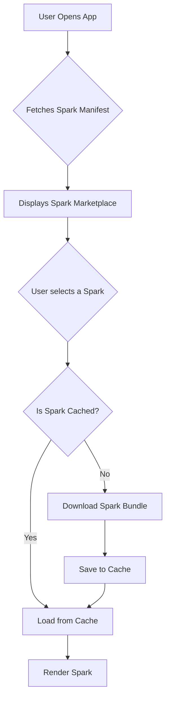

# Infinite Sparks: On-Demand Spark Loading

## 1. Vision

The goal is to transition SparksApp from a monolithic architecture, where all sparks are bundled into the main application, to a dynamic architecture where sparks can be downloaded and loaded on-demand. This will allow the app to scale to hundreds or thousands of sparks without the initial download size becoming prohibitively large.

## 2. Core Concepts

The implementation will revolve around these core ideas:

*   **Spark Manifest:** A central manifest file (e.g., `spark-manifest.json`) will be hosted on a remote server (like Firebase Storage). This manifest will contain metadata for all available sparks, including their name, description, icon, and a URL to their bundled code.
*   **Dynamic Imports:** We will leverage React Native's dynamic `import()` syntax. This allows us to defer the loading of a module until it's actually needed.
*   **Code Bundling:** Each spark will be bundled into a separate JavaScript file. These bundles will be created during the build process and uploaded to a remote server.
*   **Local Cache:** Once a spark is downloaded, it will be cached on the device's local filesystem. This will prevent the need to re-download it every time the user wants to use it.
*   **Spark Registry:** The existing `sparkRegistryData` will be modified to handle both pre-loaded (core) sparks and dynamically loaded sparks.

## 3. Proposed Architecture



## 4. Implementation Plan

### Phase 1: Infrastructure and Build Process

1.  **[ ] Create a Spark Manifest:**
    *   Define the structure of `spark-manifest.json`. It should contain an array of spark metadata objects.
    *   Create a script to automatically generate this manifest during the build process by scanning the `src/sparks` directory.
2.  **[ ] Set up Remote Storage:**
    *   Configure a cloud storage solution (e.g., Firebase Storage) to host the spark bundles and the manifest.
3.  **[ ] Modify Build Process:**
    *   Update the build scripts (e.g., `package.json` scripts) to bundle each spark into a separate file. Metro (the React Native bundler) can be configured for this.
    *   The build script should also upload the generated bundles and the manifest to the remote storage.

### Phase 2: Dynamic Loading Logic

1.  **[ ] Create a `SparkLoader` Service:**
    *   This service will be responsible for fetching the spark manifest, downloading spark bundles, and managing the local cache.
    *   It will use `expo-file-system` to save and read the downloaded spark bundles.
2.  **[ ] Update `SparkRegistry`:**
    *   Modify the `sparkRegistryData.tsx` to handle dynamically loaded sparks. Instead of directly importing the component, it will have a function that calls the `SparkLoader` to get the component.
    *   The registry will need to be able to differentiate between pre-loaded and dynamically loaded sparks.
3.  **[ ] Implement Dynamic `import()`:**
    *   The `SparkLoader` will use the dynamic `import()` syntax to load the spark component from the downloaded bundle file. This is the core of the dynamic loading mechanism.

### Phase 3: User Interface

1.  **[ ] Create a Spark Marketplace:**
    *   Develop a new screen, `MarketplaceScreen.tsx`, that displays the list of available sparks from the manifest.
    *   This screen will show the spark's name, description, and an "Install" or "Open" button.
2.  **[ ] Update `SparkSelectionScreen`:**
    *   Modify the existing `SparkSelectionScreen.tsx` to show both installed sparks and a button to go to the marketplace.
3.  **[ ] Add Loading and Error States:**
    *   Implement loading indicators for when a spark is being downloaded and error messages for when a download fails.

## 5. Security Considerations

*   **Code Signing:** To ensure the integrity of the downloaded spark bundles, they should be signed during the build process and verified on the device before being executed.
*   **Sandboxing:** While React Native's architecture provides some level of sandboxing, we should be mindful of the APIs we expose to the dynamically loaded sparks.
*   **Permissions:** Dynamically loaded sparks should not be able to request new native permissions that were not already granted to the main app.

## 6. Technical Implementation: Metro Bundler and Dynamic Imports

The key to on-demand spark loading is to configure the Metro bundler to create separate bundles for each spark, and then use dynamic `import()` to load them at runtime.

### Metro Bundler Configuration

For the most part, React Native's Metro bundler supports dynamic `import()` out of the box, especially for web builds where Expo CLI automatically splits bundles. For native builds (iOS/Android), Metro's default behavior with dynamic `import()` is to include the dynamically imported modules in the main bundle, but load them lazily.

For true on-demand loading of remote bundles, we may need to explore more advanced Metro configurations or alternative bundlers. However, for the initial implementation, we can rely on Metro's built-in support for dynamic `import()` and focus on a custom script to create separate bundles for each spark.

A custom script can be created to run Metro for each spark file individually, generating a separate bundle for each. This script would be run as part of the build process.

### Dynamic `import()` Usage

The `SparkLoader` service will be responsible for loading the spark component. It will first check if the spark's bundle is available in the local cache. If not, it will download it from the remote storage. Once the bundle is available locally, it will use a dynamic `import()` to load the component.

Here's a simplified example of how the `SparkLoader` might work:

```typescript
import * as FileSystem from 'expo-file-system';

const SPARK_CACHE_DIR = `${FileSystem.cacheDirectory}sparks/`;

export class SparkLoader {
  static async loadSpark(sparkId: string, bundleUrl: string): Promise<React.ComponentType<any>> {
    const localUri = `${SPARK_CACHE_DIR}${sparkId}.bundle.js`;
    const fileInfo = await FileSystem.getInfoAsync(localUri);

    if (!fileInfo.exists) {
      await FileSystem.makeDirectoryAsync(SPARK_CACHE_DIR, { intermediates: true });
      await FileSystem.downloadAsync(bundleUrl, localUri);
    }

    // The dynamic import path must be a string literal, so we can't use a variable.
    // This means we will have a switch statement or a map to handle the dynamic imports.
    // This is a limitation of Metro's static analysis.
    let spark;
    switch (sparkId) {
      case 'TodoSpark':
        spark = await import('../../sparks/TodoSpark');
        break;
      case 'MinuteMinderSpark':
        spark = await import('../../sparks/MinuteMinderSpark');
        break;
      // ... and so on for all sparks
      default:
        throw new Error(`Unknown spark: ${sparkId}`);
    }

    return spark.default;
  }
}
```

### `require.context` for Scaling

As the number of sparks grows, a large `switch` statement becomes unmanageable. To solve this, we can use `require.context`, a feature that allows you to dynamically import all files in a directory that match a certain pattern.

With `require.context`, the `SparkLoader` could look something like this:

```typescript
// This is a conceptual example. The exact implementation will depend on the final architecture.
const sparkContext = require.context('../../sparks', false, /\.tsx$/);

export class SparkLoader {
  static async loadSpark(sparkId: string): Promise<React.ComponentType<any>> {
    const sparkPath = `./${sparkId}.tsx`;
    if (sparkContext.keys().includes(sparkPath)) {
      const sparkModule = sparkContext(sparkPath);
      return sparkModule.default;
    } else {
      // Logic to download and load remote bundle
      // ...
    }
  }
}
```

### Initial Approach

For the initial implementation, we will proceed with the following steps:
1.  Create a custom build script to generate separate bundles for each spark.
2.  Use dynamic `import()` with a `switch` statement in the `SparkLoader` to load the sparks.
3.  As the number of sparks grows, we will investigate using `require.context` to simplify the loading process.
4.  For advanced scenarios, such as loading remote bundles directly without a custom script, we will explore using an alternative bundler like Re.Pack.